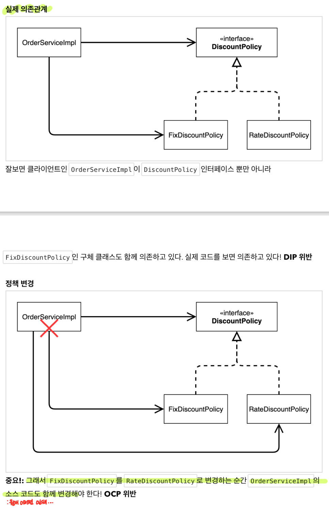

**요구사항**

회원

- 가입하고 조회 가능

- 등급이 두 가지로 구분 VIP / 일반

- 데이터는 자체 DB를 구성할 수 있고 외부 시스템으로 연동할 수도 있음 (미확정) - 인터페이스 사용

주문과 할인 정책

- 회원은 상품 주문이 가능

- 등급에 따라 할인정책 다름

- 할인 정책은 정률일 수도 정액 일 수도 있음 (미확정) - 인터페이스 사용

**Learn**

- 추상화에 의존하지 않고, 구체화에 의존하고 있다. (DIP 위배)
- 기존 코드를 변경하지 않으면서 기능을 추가할 수 있도록 설계 되어야 한다. (OCP 위배)